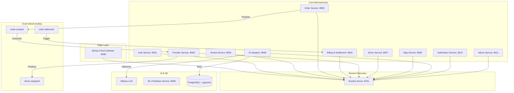

# SwiftTrack 🚚

**Enterprise-Grade, AI-Powered Logistics & Driver Management Ecosystem**

SwiftTrack is a robust, modular microservices platform designed for the next generation of logistics. It orchestrates the complete delivery lifecycle—from multi-tenant onboarding and automated driver dispatch via LLMs to real-time GPS tracking and a high-integrity financial ledger for automated settlements.

🌐 **Live Demo:** [https://swifttrack.ajayv.online](https://swifttrack.ajayv.online)  
📦 **Python SDK:** [`pip install swifttrack`](https://pypi.org/project/swifttrack/)  
🤖 **MCP Server:** Native Tooling for AI Agents (Claude/GPT)

---

## ✨ Key Technical Highlights

- **🤖 AI-First Dispatching**: Implements **Retrieval-Augmented Generation (RAG)** using `pgvector` to match orders with drivers based on historical performance, distance, and behavioral memory.
- **⚖️ Financial Integrity**: A double-entry billing system utilizing **SERIALIZABLE** transaction isolation to ensure 100% accuracy in 3-way fund splits between Tenants, Drivers, and the Platform.
- **📍 Spatial Intelligence**: High-performance nearest-driver discovery using a custom **KD-Tree** implementation, ensuring $O(\log N)$ search complexity even at scale.
- **🔌 3PL Orchestration**: Seamlessly switch between local fleets and third-party providers like **Uber Direct** or **Porter** through a unified adapter layer.
- **🚀 Automated MLOps**: Daily retraining pipelines that bake scikit-learn models into immutable Docker images, deployed via GHCR for zero-downtime rollbacks.
- **🛠️ Programmable Interface**: A published Python SDK and **FastMCP** server allowing LLMs to autonomously manage logistics operations.

---

## 🏗️ System Architecture

SwiftTrack is built on a **fully decoupled, event-driven reactive architecture**.

### Architecture Map


---

## 🧩 Microservices Catalog

The ecosystem consists of **12 specialized microservices**:

1.  **Auth Service (`:8001`)**: Identity management, JWT issuance, and RBAC for 8 roles.
2.  **Billing & Settlement (`:8002`)**: High-integrity ledger, wallet management, and automated payouts.
3.  **Tenant Service (`:8003`)**: B2B configuration, recruitment portals, and business rules.
4.  **Provider Service (`:8004`)**: Adapter layer for 3PL integrations (Uber/Porter) and local fleet management.
5.  **Order Service (`:8005`)**: State machine for delivery lifecycles and event generation.
6.  **Map Service (`:8006`)**: Routing, geocoding, ETA calculation, and OSRM/GraphHopper integration.
7.  **Driver Service (`:8007`)**: Real-time GPS tracking (Redis Geo), performance history, and vehicle management.
8.  **AI Dispatch Service (`:8008`)**: LLM-driven driver assignment using RAG and behavioral embeddings.
9.  **ML Prediction Service (`:8009`)**: Python-based inference for delivery success probability.
10. **Notification Service (`:8010`)**: Firebase Cloud Messaging (FCM) for real-time push alerts.
11. **Admin Service (`:8011`)**: Global platform overrides, margin configuration, and audit logging.
12. **GateWay & Eureka**: Infrastructure for traffic routing and service discovery.

---

## 🛠️ Technology Stack

| Layer | Technologies |
|---|---|
| **Backend** | Java 25, Spring Boot 4, Spring Cloud (Eureka, Gateway, OpenFeign), Spring AI |
| **Databases** | PostgreSQL, pgvector, Redis (Spatial Indexing), Hibernate |
| **Messaging** | Apache Kafka (9 unique event topics) |
| **AI / ML** | Ollama (qwen2.5), LangSmith, Langfuse (Tracing), scikit-learn |
| **Python** | FastAPI, Pydantic v2, FastMCP (Model Context Protocol) |
| **Frontend** | Next.js 15, React Native (Expo), Nx Monorepo, Tailwind CSS |
| **DevOps** | GitHub Actions, Docker, GHCR, OIDC (PyPI Publishing) |

---

## 📖 How to Use (Core Workflows)

### 1. Tenant & Provider Setup
- Register a **Tenant** via the Web Dashboard.
- Configure **Provider Adapters** (e.g., enable Uber Direct for overflow orders).
- Define **Serviceable Areas** using GeoJSON polygons in the Provider Dashboard.

### 2. Driver Onboarding
- Drivers register via the **SwiftTrack Mobile App**.
- Upload vehicle details and enable location tracking.
- System starts building **Driver Memory** (embeddings of performance data) in `pgvector`.

### 3. Order Lifecycle
- **Placement**: Order created via API or Dashboard.
- **Dispatch**: AI Dispatch Service retrieves the top 5 nearest drivers (via KD-Tree) and uses an LLM to select the best candidate based on RAG data.
- **Execution**: Driver receives push notification -> Accepts -> Real-time tracking begins.
- **Completion**: Driver uploads "Proof of Delivery".

### 4. Settlement
- Upon delivery, the `order-delivered` event triggers `BillingService`.
- Funds are atomically split:
    - **Driver**: Delivery fee + Tips.
    - **Tenant**: Order value minus platform fee.
    - **Platform**: Calculated margin.

---

## 🚀 Getting Started

### Prerequisites
- **Java 25** & **Node.js 22**
- **Docker** (for Kafka, Postgres, Redis)
- **Ollama** (running `qwen2.5:3b-instruct`)

### Installation
```bash
# 1. Clone & Infrastructure
git clone https://github.com/your-username/SwiftTrack.git
docker-compose -f docker/docker-compose.yml up -d

# 2. Build Backend
cd backend && mvn clean install -DskipTests

# 3. Build Frontend
cd ../frontend && pnpm install
```

---

## 🏃 Running the System

Services must be started in this specific sequence:

1. **Service Mesh**: Start `EurekaServer` then `GateWay`.
2. **Support Services**: Start `AuthService`, `MapService`, and `NotificationService`.
3. **Core Domain**: Start `TenantService`, `DriverService`, `ProviderService`, and `OrderService`.
4. **Intelligence Layer**:
   - Start **ML Service**: `uvicorn app.main:app` in `backend/ai-ml/ml`.
   - Start **AI Dispatch**: `mvn spring-boot:run` in `backend/services/AIDispatchService`.
5. **Dashboards**:
   - Web: `npx nx dev web`
   - Mobile: `npx nx run mobileapp:start`

---

## 🤖 AI & ML Deep-Dive

### RAG-Powered Dispatch
Unlike traditional greedy algorithms, SwiftTrack uses an LLM to "reason" over driver suitability.
1. **Context Retrieval**: System fetches the last 10 deliveries of nearby drivers.
2. **Behavioral Analysis**: LLM analyzes patterns (e.g., "Driver X is faster in heavy traffic").
3. **Decision**: LLM returns a structured JSON assignment.

### MLOps Pipeline
- **Retraining**: A GitHub Action runs every 24h to retrain the delivery success model.
- **Version Control**: Models are versioned in GHCR and pulled by the FastAPI inference service.

---

## 📄 License
Licensed under the [MIT License](LICENSE).
