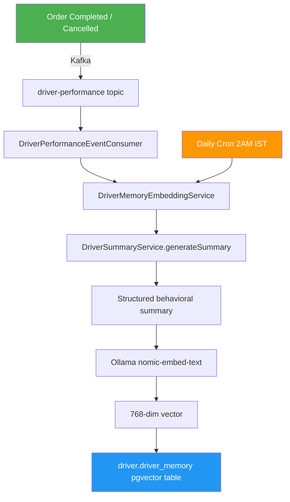

# Driver Memory Embedding (RAG Preparation) — Implementation Summary

## ✅ Status: Complete & Compiled

---

## 1️⃣ Database Changes (Supabase)

| Action | Status |
|---|---|
| `CREATE EXTENSION IF NOT EXISTS vector` | ✅ Already existed |
| `CREATE TABLE driver.driver_memory` | ✅ Created |
| `CREATE INDEX driver_memory_embedding_idx` (ivfflat) | ✅ Created |

**Table schema:**
```sql
driver.driver_memory (
  id          UUID PRIMARY KEY DEFAULT gen_random_uuid(),
  driver_id   UUID NOT NULL,
  summary     TEXT NOT NULL,
  embedding   vector(768) NOT NULL,
  created_at  TIMESTAMP DEFAULT now()
)
```

---

## 2️⃣ Dependencies Added

```diff:pom.xml
<?xml version="1.0" encoding="UTF-8"?>
<project xmlns="http://maven.apache.org/POM/4.0.0" xmlns:xsi="http://www.w3.org/2001/XMLSchema-instance"
	xsi:schemaLocation="http://maven.apache.org/POM/4.0.0 https://maven.apache.org/xsd/maven-4.0.0.xsd">
	<modelVersion>4.0.0</modelVersion>
	<parent>
		<groupId>org.springframework.boot</groupId>
		<artifactId>spring-boot-starter-parent</artifactId>
		<version>3.5.8</version>
		<relativePath/> <!-- lookup parent from repository -->
	</parent>
	<groupId>com.swifttrack</groupId>
	<artifactId>DriverService</artifactId>
	<version>0.0.1-SNAPSHOT</version>
	<name>DriverService</name>
	<description>Swifttrack Driver Service</description>
	<url/>
	<licenses>
		<license/>
	</licenses>
	<developers>
		<developer/>
	</developers>
	<scm>
		<connection/>
		<developerConnection/>
		<tag/>
		<url/>
	</scm>
	<properties>
		<java.version>25</java.version>
		<spring-cloud.version>2025.0.0</spring-cloud.version>
	</properties>
	<dependencies>
		<dependency>
			<groupId>com.swifttrack</groupId>
			<artifactId>common</artifactId>
			<version>1.0.0-SNAPSHOT</version>
		</dependency>
		<dependency>
			<groupId>org.springframework.boot</groupId>
			<artifactId>spring-boot-starter-actuator</artifactId>
		</dependency>
		<dependency>
			<groupId>org.springframework.boot</groupId>
			<artifactId>spring-boot-starter-data-jpa</artifactId>
		</dependency>
		<dependency>
			<groupId>org.springframework.boot</groupId>
			<artifactId>spring-boot-starter-web</artifactId>
		</dependency>
		<dependency>
			<groupId>org.springframework.cloud</groupId>
			<artifactId>spring-cloud-starter-netflix-eureka-client</artifactId>
		</dependency>

		<dependency>
			<groupId>org.springframework.boot</groupId>
			<artifactId>spring-boot-devtools</artifactId>
			<scope>runtime</scope>
			<optional>true</optional>
		</dependency>
		<dependency>
			<groupId>org.postgresql</groupId>
			<artifactId>postgresql</artifactId>
			<scope>runtime</scope>
		</dependency>
		<dependency>
			<groupId>org.projectlombok</groupId>
			<artifactId>lombok</artifactId>
			<optional>true</optional>
		</dependency>
		<dependency>
			<groupId>org.springframework.boot</groupId>
			<artifactId>spring-boot-starter-test</artifactId>
			<scope>test</scope>
		</dependency>
				<dependency>
			<groupId>org.springframework.cloud</groupId>
			<artifactId>spring-cloud-starter-openfeign</artifactId>
		</dependency>
		<dependency>
			<groupId>org.springdoc</groupId>
			<artifactId>springdoc-openapi-starter-webmvc-ui</artifactId>
			<version>2.8.3</version>
		</dependency>
		<dependency>
			<groupId>org.mapstruct</groupId>
			<artifactId>mapstruct</artifactId>
			<version>1.5.5.Final</version>
		</dependency>
		<dependency>
			<groupId>org.mapstruct</groupId>
			<artifactId>mapstruct-processor</artifactId>
			<version>1.5.5.Final</version>
			<scope>provided</scope>
		</dependency>

    <dependency>
        <groupId>org.springframework.kafka</groupId>
        <artifactId>spring-kafka</artifactId>
    </dependency>
    <dependency>
        <groupId>org.springframework.boot</groupId>
        <artifactId>spring-boot-starter-data-redis</artifactId>
    </dependency>
    <dependency>
        <groupId>org.liquibase</groupId>
        <artifactId>liquibase-core</artifactId>
    </dependency>
  </dependencies>
	<dependencyManagement>
		<dependencies>
			<dependency>
				<groupId>org.springframework.cloud</groupId>
				<artifactId>spring-cloud-dependencies</artifactId>
				<version>${spring-cloud.version}</version>
				<type>pom</type>
				<scope>import</scope>
			</dependency>
			<dependency>
				<groupId>org.mapstruct</groupId>
				<artifactId>mapstruct</artifactId>
				<version>1.5.5.Final</version>
			</dependency>
		</dependencies>
	</dependencyManagement>

	<build>
		<plugins>
			<plugin>
				<groupId>org.apache.maven.plugins</groupId>
				<artifactId>maven-compiler-plugin</artifactId>
				<configuration>
					<annotationProcessorPaths>
						<path>
							<groupId>org.projectlombok</groupId>
							<artifactId>lombok</artifactId>
						</path>
						<path>
							<groupId>org.mapstruct</groupId>
							<artifactId>mapstruct-processor</artifactId>
							<version>1.5.5.Final</version>
						</path>
					</annotationProcessorPaths>
				</configuration>
			</plugin>
			<plugin>
				<groupId>org.springframework.boot</groupId>
				<artifactId>spring-boot-maven-plugin</artifactId>
				<configuration>
					<excludes>
						<exclude>
							<groupId>org.projectlombok</groupId>
							<artifactId>lombok</artifactId>
						</exclude>
					</excludes>
				</configuration>
			</plugin>
		</plugins>
	</build>
</project>
===
<?xml version="1.0" encoding="UTF-8"?>
<project xmlns="http://maven.apache.org/POM/4.0.0" xmlns:xsi="http://www.w3.org/2001/XMLSchema-instance"
	xsi:schemaLocation="http://maven.apache.org/POM/4.0.0 https://maven.apache.org/xsd/maven-4.0.0.xsd">
	<modelVersion>4.0.0</modelVersion>
	<parent>
		<groupId>org.springframework.boot</groupId>
		<artifactId>spring-boot-starter-parent</artifactId>
		<version>3.5.8</version>
		<relativePath/> <!-- lookup parent from repository -->
	</parent>
	<groupId>com.swifttrack</groupId>
	<artifactId>DriverService</artifactId>
	<version>0.0.1-SNAPSHOT</version>
	<name>DriverService</name>
	<description>Swifttrack Driver Service</description>
	<url/>
	<licenses>
		<license/>
	</licenses>
	<developers>
		<developer/>
	</developers>
	<scm>
		<connection/>
		<developerConnection/>
		<tag/>
		<url/>
	</scm>
	<properties>
		<java.version>25</java.version>
		<spring-cloud.version>2025.0.0</spring-cloud.version>
		<spring-ai.version>1.0.0</spring-ai.version>
	</properties>
	<dependencies>
		<dependency>
			<groupId>com.swifttrack</groupId>
			<artifactId>common</artifactId>
			<version>1.0.0-SNAPSHOT</version>
		</dependency>
		<dependency>
			<groupId>org.springframework.boot</groupId>
			<artifactId>spring-boot-starter-actuator</artifactId>
		</dependency>
		<dependency>
			<groupId>org.springframework.boot</groupId>
			<artifactId>spring-boot-starter-data-jpa</artifactId>
		</dependency>
		<dependency>
			<groupId>org.springframework.boot</groupId>
			<artifactId>spring-boot-starter-web</artifactId>
		</dependency>
		<dependency>
			<groupId>org.springframework.cloud</groupId>
			<artifactId>spring-cloud-starter-netflix-eureka-client</artifactId>
		</dependency>

		<dependency>
			<groupId>org.springframework.boot</groupId>
			<artifactId>spring-boot-devtools</artifactId>
			<scope>runtime</scope>
			<optional>true</optional>
		</dependency>
		<dependency>
			<groupId>org.postgresql</groupId>
			<artifactId>postgresql</artifactId>
			<scope>runtime</scope>
		</dependency>
		<dependency>
			<groupId>org.projectlombok</groupId>
			<artifactId>lombok</artifactId>
			<optional>true</optional>
		</dependency>
		<dependency>
			<groupId>org.springframework.boot</groupId>
			<artifactId>spring-boot-starter-test</artifactId>
			<scope>test</scope>
		</dependency>
				<dependency>
			<groupId>org.springframework.cloud</groupId>
			<artifactId>spring-cloud-starter-openfeign</artifactId>
		</dependency>
		<dependency>
			<groupId>org.springdoc</groupId>
			<artifactId>springdoc-openapi-starter-webmvc-ui</artifactId>
			<version>2.8.3</version>
		</dependency>
		<dependency>
			<groupId>org.mapstruct</groupId>
			<artifactId>mapstruct</artifactId>
			<version>1.5.5.Final</version>
		</dependency>
		<dependency>
			<groupId>org.mapstruct</groupId>
			<artifactId>mapstruct-processor</artifactId>
			<version>1.5.5.Final</version>
			<scope>provided</scope>
		</dependency>

    <dependency>
        <groupId>org.springframework.kafka</groupId>
        <artifactId>spring-kafka</artifactId>
    </dependency>
    <dependency>
        <groupId>org.springframework.boot</groupId>
        <artifactId>spring-boot-starter-data-redis</artifactId>
    </dependency>
    <dependency>
        <groupId>org.liquibase</groupId>
        <artifactId>liquibase-core</artifactId>
    </dependency>
    <dependency>
        <groupId>org.springframework.ai</groupId>
        <artifactId>spring-ai-starter-model-ollama</artifactId>
    </dependency>
  </dependencies>
	<dependencyManagement>
		<dependencies>
			<dependency>
				<groupId>org.springframework.cloud</groupId>
				<artifactId>spring-cloud-dependencies</artifactId>
				<version>${spring-cloud.version}</version>
				<type>pom</type>
				<scope>import</scope>
			</dependency>
			<dependency>
				<groupId>org.mapstruct</groupId>
				<artifactId>mapstruct</artifactId>
				<version>1.5.5.Final</version>
			</dependency>
			<dependency>
				<groupId>org.springframework.ai</groupId>
				<artifactId>spring-ai-bom</artifactId>
				<version>${spring-ai.version}</version>
				<type>pom</type>
				<scope>import</scope>
			</dependency>
		</dependencies>
	</dependencyManagement>

	<build>
		<plugins>
			<plugin>
				<groupId>org.apache.maven.plugins</groupId>
				<artifactId>maven-compiler-plugin</artifactId>
				<configuration>
					<annotationProcessorPaths>
						<path>
							<groupId>org.projectlombok</groupId>
							<artifactId>lombok</artifactId>
						</path>
						<path>
							<groupId>org.mapstruct</groupId>
							<artifactId>mapstruct-processor</artifactId>
							<version>1.5.5.Final</version>
						</path>
					</annotationProcessorPaths>
				</configuration>
			</plugin>
			<plugin>
				<groupId>org.springframework.boot</groupId>
				<artifactId>spring-boot-maven-plugin</artifactId>
				<configuration>
					<excludes>
						<exclude>
							<groupId>org.projectlombok</groupId>
							<artifactId>lombok</artifactId>
						</exclude>
					</excludes>
				</configuration>
			</plugin>
		</plugins>
	</build>
</project>
```

- **Spring AI BOM** `1.0.0` added to `<dependencyManagement>`
- **`spring-ai-starter-model-ollama`** dependency added
- PostgreSQL driver already existed ✅

---

## 3️⃣ Configuration Changes

```diff:application.yaml
spring:
  application:
    name: DriverService
  datasource:
    url: jdbc:postgresql://${DB_HOST}:${DB_PORT}/${DB_NAME}?currentSchema=driver
    username: ${DB_USERNAME}
    password: ${DB_PASSWORD}
    driver-class-name: org.postgresql.Driver

  jpa:
    hibernate:
      ddl-auto: none
    show-sql: true
    properties:
      hibernate:
        dialect: org.hibernate.dialect.PostgreSQLDialect
        format_sql: true
  liquibase:
    change-log: classpath:db/changelog/db.changelog-master.yaml
    enabled: true
    drop-first: false
  kafka:
    bootstrap-servers: localhost:9092
    producer:
      key-serializer: org.apache.kafka.common.serialization.StringSerializer
      value-serializer: org.springframework.kafka.support.serializer.JsonSerializer
    consumer:
      group-id: driver-service-group
      auto-offset-reset: earliest
      key-deserializer: org.apache.kafka.common.serialization.StringDeserializer
      value-deserializer: org.springframework.kafka.support.serializer.JsonDeserializer
      properties:
        spring.json.trusted.packages: "*"
  data:
    redis:
      host: localhost
      port: 6379

server:
  port: ${SERVER_PORT:8007}
eureka:
  client:
    service-url:
      defaultZone: ${EUREKA_URL:http://127.0.0.1:8761/eureka/}
  instance:
    hostname: 127.0.0.1
    prefer-ip-address: true
    ip-address: 127.0.0.1
    instance-id: ${spring.application.name}:${server.port}
springdoc:
  api-docs:
    path: /v3/api-docs
  swagger-ui:
    path: /swagger-ui.html
    enabled: true
    operations-sorter: method
    tags-sorter: alpha
    use-root-path: true
    show-extensions: true
  show-actuator: false
  cache:
    type: redis
    redis:
      time-to-live: 60000 

===
spring:
  application:
    name: DriverService
  datasource:
    url: jdbc:postgresql://${DB_HOST}:${DB_PORT}/${DB_NAME}?currentSchema=driver
    username: ${DB_USERNAME}
    password: ${DB_PASSWORD}
    driver-class-name: org.postgresql.Driver

  jpa:
    hibernate:
      ddl-auto: none
    show-sql: true
    properties:
      hibernate:
        dialect: org.hibernate.dialect.PostgreSQLDialect
        format_sql: true
  liquibase:
    change-log: classpath:db/changelog/db.changelog-master.yaml
    enabled: true
    drop-first: false
  kafka:
    bootstrap-servers: localhost:9092
    producer:
      key-serializer: org.apache.kafka.common.serialization.StringSerializer
      value-serializer: org.springframework.kafka.support.serializer.JsonSerializer
    consumer:
      group-id: driver-service-group
      auto-offset-reset: earliest
      key-deserializer: org.apache.kafka.common.serialization.StringDeserializer
      value-deserializer: org.springframework.kafka.support.serializer.JsonDeserializer
      properties:
        spring.json.trusted.packages: "*"
  ai:
    ollama:
      base-url: http://localhost:11434
      embedding:
        options:
          model: nomic-embed-text
  data:
    redis:
      host: localhost
      port: 6379

server:
  port: ${SERVER_PORT:8007}
eureka:
  client:
    service-url:
      defaultZone: ${EUREKA_URL:http://127.0.0.1:8761/eureka/}
  instance:
    hostname: 127.0.0.1
    prefer-ip-address: true
    ip-address: 127.0.0.1
    instance-id: ${spring.application.name}:${server.port}
springdoc:
  api-docs:
    path: /v3/api-docs
  swagger-ui:
    path: /swagger-ui.html
    enabled: true
    operations-sorter: method
    tags-sorter: alpha
    use-root-path: true
    show-extensions: true
  show-actuator: false
  cache:
    type: redis
    redis:
      time-to-live: 60000 

```

```yaml
spring:
  ai:
    ollama:
      base-url: http://localhost:11434
      embedding:
        options:
          model: nomic-embed-text
```

**Ollama status:** ✅ Running locally with `nomic-embed-text:latest` model pulled.

---

## 4️⃣ New Files Created

### Models
- [DriverMemory.java](file:///home/ajay/Ajay/Personal/SwiftTrack/backend/services/DriverService/src/main/java/com/swifttrack/DriverService/models/DriverMemory.java) — JPA entity for `driver_memory` table

### Repositories
- [DriverMemoryRepository.java](file:///home/ajay/Ajay/Personal/SwiftTrack/backend/services/DriverService/src/main/java/com/swifttrack/DriverService/repositories/DriverMemoryRepository.java) — Native SQL insert with `CAST(:embedding AS vector)` for pgvector

### DTOs
- [DriverPerformanceEvent.java](file:///home/ajay/Ajay/Personal/SwiftTrack/backend/services/DriverService/src/main/java/com/swifttrack/DriverService/dto/DriverPerformanceEvent.java) — Event DTO with trigger types: `ORDER_COMPLETED`, `ORDER_CANCELLED`, `RATING_UPDATED`, `DAILY_AGGREGATION`

### Services
- [DriverMemoryEmbeddingService.java](file:///home/ajay/Ajay/Personal/SwiftTrack/backend/services/DriverService/src/main/java/com/swifttrack/DriverService/services/DriverMemoryEmbeddingService.java) — Core embedding pipeline: summary → Ollama → pgvector
- [DriverSummaryService.java](file:///home/ajay/Ajay/Personal/SwiftTrack/backend/services/DriverService/src/main/java/com/swifttrack/DriverService/services/DriverSummaryService.java) — Generates structured behavioral summaries from driver data
- [DriverMemoryScheduledJob.java](file:///home/ajay/Ajay/Personal/SwiftTrack/backend/services/DriverService/src/main/java/com/swifttrack/DriverService/services/DriverMemoryScheduledJob.java) — Daily cron job at 2 AM IST for all drivers

### Event Consumers
- [DriverPerformanceEventConsumer.java](file:///home/ajay/Ajay/Personal/SwiftTrack/backend/services/DriverService/src/main/java/com/swifttrack/DriverService/events/DriverPerformanceEventConsumer.java) — Kafka consumer on `driver-performance` topic

---

## 5️⃣ Modified Files

### DriverService.java (trigger points)

```diff:DriverService.java
package com.swifttrack.DriverService.services;

import java.math.BigDecimal;
import java.time.LocalDateTime;
import java.util.ArrayList;
import java.util.List;
import java.util.UUID;

import org.springframework.beans.factory.annotation.Autowired;
import org.springframework.data.domain.Page;
import org.springframework.data.domain.Pageable;
import org.springframework.stereotype.Service;
import org.springframework.transaction.annotation.Transactional;

import com.swifttrack.DriverService.models.DriverVehicleDetails;
import com.swifttrack.DriverService.dto.RegisterDriver;
import com.swifttrack.DriverService.dto.UpdateOrderStatusrequest;
import com.swifttrack.DriverService.models.DriverLocationLive;
import com.swifttrack.DriverService.models.DriverOrderAssignment;
import com.swifttrack.DriverService.models.DriverStatus;
import com.swifttrack.DriverService.repositories.DriverLocationLiveRepository;
import com.swifttrack.DriverService.repositories.DriverOrderAssignmentRepository;
import com.swifttrack.DriverService.repositories.DriverVehicleDetailsRepository;
import com.swifttrack.FeignClient.AuthInterface;
import com.swifttrack.dto.ListOfTenantUsers;
import com.swifttrack.dto.Message;
import com.swifttrack.dto.RegisterDriverResponse;
import com.swifttrack.dto.RegisterUser;
import com.swifttrack.dto.TokenResponse;
import com.swifttrack.dto.authDto.GetDriverUsers;
import com.swifttrack.dto.driverDto.AddTenantDriver;
import com.swifttrack.dto.driverDto.AddTennatDriverResponse;
import com.swifttrack.dto.driverDto.GetAllDriverUser;
import com.swifttrack.dto.driverDto.GetDriverUserDetails;
import com.swifttrack.dto.driverDto.GetTenantDrivers;
import com.swifttrack.dto.driverDto.UpdateDriverStatusRequest;
import com.swifttrack.DriverService.repositories.DriverStatusRepository;
import com.swifttrack.enums.DriverAssignmentStatus;
import com.swifttrack.enums.DriverOnlineStatus;
import com.swifttrack.enums.TrackingStatus;
import com.swifttrack.enums.UserType;
import com.swifttrack.enums.VerificationStatus;
import com.swifttrack.events.DriverLocationUpdates;

import lombok.extern.slf4j.Slf4j;

@Service
@Slf4j
public class DriverService {

    @Autowired
    private DriverVehicleDetailsRepository driverVehicleDetailsRepository;

    @Autowired
    private DriverStatusRepository driverStatusRepository;

    @Autowired
    private DriverLocationLiveRepository driverLocationLiveRepository;

    @Autowired
    private DriverOrderAssignmentRepository driverAssignmentRepository;

    @Autowired
    AuthInterface authInterface;

    @Autowired
    com.swifttrack.FeignClient.OrderInterface orderInterface;

    @Autowired
    private org.springframework.data.redis.core.RedisTemplate<String, Object> redisTemplate;

    @Transactional
    public Message createDriverProfile(String token, AddTenantDriver entity) {
        AddTennatDriverResponse response = authInterface.addTenantDrivers(token, entity).getBody();
        DriverVehicleDetails driverVehicleDetails = new DriverVehicleDetails();
        driverVehicleDetails.setDriverId(response.userId());
        driverVehicleDetails.setTenantId(response.tenantId());
        driverVehicleDetails.setVehicleType(entity.vehicleType());
        driverVehicleDetails.setLicenseNumber(entity.vehicleNumber());
        driverVehicleDetails.setDriverLicensNumber(entity.driverLicensNumber());
        driverVehicleDetailsRepository.save(driverVehicleDetails);
        return new Message("Driver profile created successfully");
    }

    public DriverVehicleDetails getDriverProfile(UUID driverId) {
        return driverVehicleDetailsRepository.findById(driverId)
                .orElseThrow(() -> new RuntimeException("Driver profile not found"));
    }

    @Transactional
    public void updateDriverLocation(UUID driverId, BigDecimal lat, BigDecimal lng) {
        // Update Live Location Table (HOT)
        DriverLocationLive location = driverLocationLiveRepository.findById(driverId)
                .orElse(new DriverLocationLive());
        driverEventUtil.addDriverPreviousLocation(driverId, location.getTenantId(), location.getLatitude(),
                location.getLongitude());
        if (location.getDriverId() == null) {
            DriverVehicleDetails details = getDriverProfile(driverId);
            location.setDriverId(driverId);
            location.setTenantId(details.getTenantId());
        }

        location.setLatitude(lat);
        location.setLongitude(lng);
        // updatedAt is handled by PreUpdate or manually
        location.setUpdatedAt(LocalDateTime.now());

        driverLocationLiveRepository.save(location);

        // Update Driver Status Last Seen
        DriverStatus status = driverStatusRepository.findById(driverId)
                .orElseThrow(() -> new RuntimeException("Driver Status not found"));
        status.setLastSeenAt(LocalDateTime.now());
        driverStatusRepository.save(status);
        // Log Login Event
        driverEventUtil.logEvent(driverId, status.getTenantId(),
                com.swifttrack.enums.DriverEventType.LOCATION_UPDATE, "Driver location updated via UpdateStatus");
    }

    @Autowired
    private com.swifttrack.DriverService.utils.DriverEventUtil driverEventUtil;

    @Autowired
    private com.swifttrack.DriverService.utils.KafkaProducerUtil kafkaProducerUtil;

    @Transactional
    public void toggleOnlineStatus(UUID driverId, boolean isOnline) {
        DriverStatus driverStatus = driverStatusRepository.findById(driverId)
                .orElseThrow(() -> new RuntimeException("Driver Status not found"));

        if (isOnline) {
            driverStatus.setStatus(DriverOnlineStatus.ONLINE);
            driverEventUtil.logEvent(driverId, driverStatus.getTenantId(), com.swifttrack.enums.DriverEventType.ONLINE,
                    "Driver went online");
        } else {
            driverStatus.setStatus(DriverOnlineStatus.OFFLINE);
            driverEventUtil.logEvent(driverId, driverStatus.getTenantId(), com.swifttrack.enums.DriverEventType.OFFLINE,
                    "Driver went offline");
        }
        driverStatus.setLastSeenAt(LocalDateTime.now());
        driverStatusRepository.save(driverStatus);
    }

    @Transactional
    public Message updateDriverStatus(String token, com.swifttrack.dto.driverDto.UpdateDriverStatusRequest request) {
        com.swifttrack.dto.TokenResponse userDetails = authInterface.getUserDetails(token).getBody();
        if (userDetails == null || userDetails.id() == null) {
            throw new RuntimeException("Invalid token or user not found");
        }
        UUID driverId = userDetails.id();
        UUID tenantId = userDetails.tenantId().orElse(null);
        log.info("Driver ID: {}", driverId);
        log.info("Tenant ID: {}", tenantId);
        if (!driverVehicleDetailsRepository.findByDriverId(driverId).isPresent()) {
            throw new RuntimeException("Driver profile not found. Please complete driver registration first.");
        }

        DriverStatus driverStatus = driverStatusRepository.findById(driverId)
                .orElse(new DriverStatus(driverId, tenantId, DriverOnlineStatus.OFFLINE, LocalDateTime.now()));

        // Ensure tenant matched if existing
        if (driverStatus.getTenantId() == null && tenantId != null) {
            driverStatus.setTenantId(tenantId);
        }

        driverStatus.setStatus(request.status());
        driverStatus.setLastSeenAt(LocalDateTime.now());
        driverStatusRepository.save(driverStatus);

        // Log event
        com.swifttrack.enums.DriverEventType eventType = null;
        if (request.status() == DriverOnlineStatus.ONLINE) {
            eventType = com.swifttrack.enums.DriverEventType.ONLINE;
        } else if (request.status() == DriverOnlineStatus.OFFLINE) {
            eventType = com.swifttrack.enums.DriverEventType.OFFLINE;
        }

        if (eventType != null) {
            driverEventUtil.logEvent(driverId, tenantId, eventType, "Status updated to " + request.status());
        }
        // Log Login Event
        driverEventUtil.logEvent(driverId, userDetails.tenantId().orElse(null),
                com.swifttrack.enums.DriverEventType.UPDATE_STATUS, "Driver status updated via UpdateStatus");
        return new Message("Driver status updated successfully");
    }

    @Transactional
    public DriverOrderAssignment assignOrder(String token, UUID driverId, UUID orderId) {
        // Check if order exists in Redis cache first
        String cacheKey = "orders::" + orderId.toString();
        com.swifttrack.dto.orderDto.OrderDetailsResponse cachedOrder = null;

        try {
            cachedOrder = (com.swifttrack.dto.orderDto.OrderDetailsResponse) redisTemplate.opsForValue().get(cacheKey);
        } catch (Exception e) {
            log.warn("Error fetching order from Redis: {}", e.getMessage());
        }

        if (cachedOrder != null) {
            System.out.println("Fetching order from Redis Cache: " + cacheKey);
        } else {
            System.out.println("Cache miss. Fetching from Order Service: " + cacheKey);
            try {
                cachedOrder = orderInterface.getOrderById(token, orderId).getBody();
                if (cachedOrder != null) {
                    redisTemplate.opsForValue().set(cacheKey, cachedOrder);
                }
            } catch (Exception e) {
                throw new RuntimeException("Order not found or invalid Order ID");
            }
        }

        if (driverAssignmentRepository.findByOrderId(orderId).isPresent()) {
            throw new RuntimeException("Order is already assigned to a driver");
        }
        DriverStatus driverStatus = driverStatusRepository.findById(driverId)
                .orElseThrow(() -> new RuntimeException("Driver Status not found"));

        if (driverStatus.getStatus() != DriverOnlineStatus.ONLINE) {
            throw new RuntimeException("Driver is not available (OFFLINE/BUSY/SUSPENDED)");
        }

        DriverOrderAssignment assignment = new DriverOrderAssignment();
        assignment.setDriverId(driverId);
        assignment.setOrderId(orderId);
        assignment.setTenantId(driverStatus.getTenantId());
        assignment.setStatus(DriverAssignmentStatus.ASSIGNED);

        return driverAssignmentRepository.save(assignment);
    }

    @Transactional
    public void respondToAssignment(String token, UUID orderId, boolean accept, String reason) {
        DriverOrderAssignment assignment = driverAssignmentRepository.findByOrderId(orderId)
                .orElseThrow(() -> new RuntimeException("Assignment not found"));

        if (assignment.getStatus() != DriverAssignmentStatus.ASSIGNED) {
            throw new RuntimeException("Assignment is not in pending state");
        }
        // Mark driver as ON_TRIP
        DriverStatus driverStatus = driverStatusRepository.findById(assignment.getDriverId())
                .orElseThrow(() -> new RuntimeException("Driver Status not found"));
        if (accept) {
            assignment.setStatus(DriverAssignmentStatus.ACCEPTED);

            driverStatus.setStatus(DriverOnlineStatus.ON_TRIP);
            driverStatusRepository.save(driverStatus);
            driverEventUtil.logEvent(assignment.getDriverId(), assignment.getTenantId(),
                    com.swifttrack.enums.DriverEventType.ORDER_ACCEPTED, "Order accepted by driver");
            driverAssignmentRepository.save(assignment);

            // Fetch Driver Details from Auth Service
            TokenResponse userDetails = authInterface.getUserDetails(token).getBody();
            DriverVehicleDetails vehicleDetails = driverVehicleDetailsRepository
                    .findByDriverId(assignment.getDriverId())
                    .orElse(new DriverVehicleDetails());

            // Create and Send DriverAssignedEvent
            com.swifttrack.events.DriverAssignedEvent event = com.swifttrack.events.DriverAssignedEvent.builder()
                    .orderId(orderId)
                    .driverName(userDetails.name())
                    .driverPhone(userDetails.mobile())
                    .vehicleNumber(vehicleDetails.getLicenseNumber()) // Assuming licenseNumber is vehicle number
                    .providerCode(userDetails.providerId().map(UUID::toString)
                            .orElse(userDetails.tenantId().map(UUID::toString).orElse("UNKNOWN")))
                    .build();

            kafkaProducerUtil.sendMessage("driver-assigned", event);

        } else {
            driverStatus.setStatus(DriverOnlineStatus.ONLINE);
            driverStatusRepository.save(driverStatus);
            assignment.setStatus(DriverAssignmentStatus.REJECTED);
            driverEventUtil.logEvent(assignment.getDriverId(), assignment.getTenantId(),
                    com.swifttrack.enums.DriverEventType.ORDER_CANCELLED, "Order rejected by driver");
            driverAssignmentRepository.delete(assignment);

            // Send Driver Canceled Event
            kafkaProducerUtil.sendMessage("driver-canceled", orderId);
        }
    }

    public List<com.swifttrack.dto.orderDto.GetOrdersForDriver> getMyOrders(String token, DriverAssignmentStatus status,
            int page, int size) {
        TokenResponse userDetails = authInterface.getUserDetails(token).getBody();
        UUID driverId = userDetails.id();

        Pageable pageable = org.springframework.data.domain.PageRequest.of(page, size);
        Page<DriverOrderAssignment> assignments = driverAssignmentRepository.findByDriverIdAndStatus(driverId, status,
                pageable);

        List<UUID> orderIds = assignments.getContent().stream()
                .map(DriverOrderAssignment::getOrderId)
                .collect(java.util.stream.Collectors.toList());

        if (orderIds.isEmpty()) {
            return new ArrayList<>();
        }
        System.out.println("Order IDs: " + orderIds);

        // Check Redis Cache first
        String cacheKey = "driverOrders::" + orderIds.toString();
        List<com.swifttrack.dto.orderDto.GetOrdersForDriver> cachedOrders = (List<com.swifttrack.dto.orderDto.GetOrdersForDriver>) redisTemplate
                .opsForValue().get(cacheKey);

        if (cachedOrders != null) {
            System.out.println("Fetching orders from Redis Cache: " + cacheKey);
            return cachedOrders;
        }

        System.out.println("Cache miss. Fetching from Order Service: " + cacheKey);
        List<com.swifttrack.dto.orderDto.GetOrdersForDriver> orders = orderInterface
                .getOrdersForDriver(token, new com.swifttrack.dto.orderDto.GetOrdersRequest(orderIds)).getBody();

        // Cache the result
        // Note: OrderService might already be caching it, but if we want to be sure or
        // control TTL from here:
        // redisTemplate.opsForValue().set(cacheKey, orders);
        // Since OrderService uses @Cacheable with same key, it should ideally populate
        // it.
        // But if we want to ensure *this* service populates it if missed:
        if (orders != null) {
            redisTemplate.opsForValue().set(cacheKey, orders);
        }

        return orders;
    }

    public Page<DriverVehicleDetails> getDriversByTenant(UUID tenantId, Pageable pageable) {
        return driverVehicleDetailsRepository.findByTenantId(tenantId, pageable);
    }

    public TokenResponse validateToken(String token) {
        TokenResponse userDetails = authInterface.getUserDetails(token).getBody();
        if (userDetails == null || userDetails.id() == null) {
            throw new RuntimeException("Invalid token or user not found");
        }
        return userDetails;
    }

    public GetDriverUserDetails getDriverUserDetails(String token) {
        TokenResponse userDetails = authInterface.getUserDetails(token).getBody();
        if (userDetails == null || userDetails.id() == null) {
            throw new RuntimeException("Invalid token or user not found");
        }
        UUID driverId = userDetails.id();
        DriverVehicleDetails driverVehicleDetails = driverVehicleDetailsRepository.findByDriverId(driverId)
                .orElseThrow(() -> new RuntimeException("Driver profile not found"));
        DriverStatus driverStatus = driverStatusRepository.findById(driverId)
                .orElseThrow(() -> new RuntimeException("Driver Status not found"));
        // Log Login Event
        driverEventUtil.logEvent(driverId, userDetails.tenantId().orElse(null),
                com.swifttrack.enums.DriverEventType.LOGIN, "Driver Logged In via GetDetails");
        return new GetDriverUserDetails(userDetails, driverVehicleDetails.getVehicleType(),
                driverVehicleDetails.getLicenseNumber(), driverVehicleDetails.getDriverLicensNumber(),
                driverStatus.getStatus());
    }

    // --- APIs for Other Services ---

    public DriverStatus getDriverStatus(UUID driverId) {
        return driverStatusRepository.findById(driverId)
                .orElseThrow(() -> new RuntimeException("Driver Status not found"));
    }

    public DriverLocationLive getDriverLocation(UUID driverId) {
        return driverLocationLiveRepository.findById(driverId)
                .orElseThrow(() -> new RuntimeException("Driver location not found"));
    }

    public boolean isDriverAvailable(UUID driverId) {
        return driverStatusRepository.findById(driverId)
                .map(status -> status.getStatus() == DriverOnlineStatus.ONLINE)
                .orElse(false);
    }

    public List<GetTenantDrivers> getTenantDrivers(String token) {
        List<ListOfTenantUsers> tenantUsers = authInterface.getTenantUsers(token, UserType.TENANT_DRIVER).getBody();
        List<GetTenantDrivers> driverDetailsList = new ArrayList<>();

        if (tenantUsers != null) {
            for (ListOfTenantUsers user : tenantUsers) {
                DriverVehicleDetails vehicleDetails = driverVehicleDetailsRepository
                        .findByDriverId(user.id())
                        .orElse(new DriverVehicleDetails());

                DriverStatus driverStatus = driverStatusRepository
                        .findById(user.id())
                        .orElse(new DriverStatus());

                String vType = (vehicleDetails.getVehicleType() != null) ? vehicleDetails.getVehicleType().name()
                        : null;

                GetTenantDrivers dto = new GetTenantDrivers(
                        user.id(),
                        user.name(),
                        user.email(),
                        user.mobile(),
                        vType,
                        vehicleDetails.getLicenseNumber(),
                        vehicleDetails.getDriverLicensNumber(),
                        driverStatus.getStatus(),
                        driverStatus.getLastSeenAt(),
                        vehicleDetails.getCreatedAt(),
                        vehicleDetails.getUpdatedAt());
                driverDetailsList.add(dto);
            }
        }
        return driverDetailsList;
    }

    public Message updateOrderStatus(String token, UpdateOrderStatusrequest request) {
        String cacheKey = "orderStatus::" + request.orderId().toString();
        String orderStatus = (String) redisTemplate.opsForValue().get(cacheKey);

        if (orderStatus == null) {
            System.out.println("Cache miss for OrderStatus. Fetching from Order Service: " + cacheKey);
            orderStatus = orderInterface.getOrderStatus(token, request.orderId()).getBody();
            if (orderStatus != null) {
                redisTemplate.opsForValue().set(cacheKey, orderStatus);
            }
        } else {
            System.out.println("Fetching OrderStatus from Redis Cache: " + cacheKey);
        }
        TokenResponse userDetails = authInterface.getUserDetails(token).getBody();
        DriverLocationLive driverLocationLive = driverLocationLiveRepository.findById(userDetails.id())
                .orElseThrow(() -> new RuntimeException("Driver location not found"));
        if (orderStatus.equals("PICKED_UP") && request.status() != TrackingStatus.IN_TRANSIT) {
            throw new RuntimeException("Invalid status transition, order is not picked up");
        } else if (orderStatus.equals("IN_TRANSIT") && request.status() != TrackingStatus.OUT_FOR_DELIVERY) {
            throw new RuntimeException("Invalid status transition, order is not in transit");
        } else if (orderStatus.equals("OUT_FOR_DELIVERY") && request.status() != TrackingStatus.DELIVERED) {
            throw new RuntimeException("Invalid status transition, order is not out for delivery");
        }
        if (orderStatus.equals("DELIVERED")) {
            DriverStatus driverStatus = driverStatusRepository.findById(userDetails.id())
                    .orElseThrow(() -> new RuntimeException("Driver Status not found"));
            driverStatus.setStatus(DriverOnlineStatus.ONLINE);
            driverStatusRepository.save(driverStatus);
            DriverOrderAssignment driverOrderAssignment = driverAssignmentRepository.findByOrderId(request.orderId())
                    .orElseThrow(() -> new RuntimeException("Driver Order Assignment not found"));
            driverOrderAssignment.setStatus(DriverAssignmentStatus.COMPLETED);
            driverAssignmentRepository.save(driverOrderAssignment);
        }

        DriverLocationUpdates driverLocationUpdates = DriverLocationUpdates.builder()
                .orderId(request.orderId())
                .status(request.status().toString())
                .latitude(driverLocationLive.getLatitude())
                .longitude(driverLocationLive.getLongitude())
                .build();
        kafkaProducerUtil.sendMessage("driver-location-updates", driverLocationUpdates);
        return new Message("Order status updated successfully");
    }

    public Message registerDriver(RegisterDriver input) {
        RegisterDriverResponse driverId = authInterface
                .registerUser(new RegisterUser(input.name(), input.password(), input.email(),
                        input.mobile(), UserType.DRIVER_USER))
                .getBody();
        if (driverId == null) {
            throw new RuntimeException("Driver registration failed");
        }
        DriverVehicleDetails driverVehicleDetails = new DriverVehicleDetails();
        driverVehicleDetails.setDriverId(driverId.id());
        driverVehicleDetails.setVehicleType(input.vehicleType());
        driverVehicleDetails.setLicenseNumber(input.vehicleNumber());
        driverVehicleDetails.setDriverLicensNumber(input.driverLicensNumber());
        driverVehicleDetailsRepository.save(driverVehicleDetails);
        DriverStatus driverStatus = new DriverStatus();
        driverStatus.setDriverId(driverId.id());
        driverStatus.setStatus(DriverOnlineStatus.OFFLINE);
        driverStatusRepository.save(driverStatus);
        return new Message("Driver registered successfully");
    }

    public List<GetAllDriverUser> getDriverUsers(String token, VerificationStatus verificationStatus) {
        List<GetDriverUsers> driverUsers = authInterface.getDriverUsers(token, verificationStatus).getBody();
        List<GetAllDriverUser> driverDetailsList = new ArrayList<>();
        if (driverUsers != null) {
            for (GetDriverUsers user : driverUsers) {
                DriverVehicleDetails vehicleDetails = driverVehicleDetailsRepository
                        .findByDriverId(user.id())
                        .orElse(new DriverVehicleDetails());

                GetAllDriverUser dto = new GetAllDriverUser(
                        user.id(),
                        user.name(),
                        user.email(),
                        user.mobile(),
                        vehicleDetails.getVehicleType(),
                        vehicleDetails.getLicenseNumber(),
                        vehicleDetails.getDriverLicensNumber());
                driverDetailsList.add(dto);
            }
        }
        return driverDetailsList;
    }
}
===
package com.swifttrack.DriverService.services;

import java.math.BigDecimal;
import java.time.LocalDateTime;
import java.util.ArrayList;
import java.util.List;
import java.util.UUID;

import org.springframework.beans.factory.annotation.Autowired;
import org.springframework.data.domain.Page;
import org.springframework.data.domain.Pageable;
import org.springframework.stereotype.Service;
import org.springframework.transaction.annotation.Transactional;

import com.swifttrack.DriverService.models.DriverVehicleDetails;
import com.swifttrack.DriverService.dto.DriverPerformanceEvent;
import com.swifttrack.DriverService.dto.RegisterDriver;
import com.swifttrack.DriverService.dto.UpdateOrderStatusrequest;
import com.swifttrack.DriverService.models.DriverLocationLive;
import com.swifttrack.DriverService.models.DriverOrderAssignment;
import com.swifttrack.DriverService.models.DriverStatus;
import com.swifttrack.DriverService.repositories.DriverLocationLiveRepository;
import com.swifttrack.DriverService.repositories.DriverOrderAssignmentRepository;
import com.swifttrack.DriverService.repositories.DriverVehicleDetailsRepository;
import com.swifttrack.FeignClient.AuthInterface;
import com.swifttrack.dto.ListOfTenantUsers;
import com.swifttrack.dto.Message;
import com.swifttrack.dto.RegisterDriverResponse;
import com.swifttrack.dto.RegisterUser;
import com.swifttrack.dto.TokenResponse;
import com.swifttrack.dto.authDto.GetDriverUsers;
import com.swifttrack.dto.driverDto.AddTenantDriver;
import com.swifttrack.dto.driverDto.AddTennatDriverResponse;
import com.swifttrack.dto.driverDto.GetAllDriverUser;
import com.swifttrack.dto.driverDto.GetDriverUserDetails;
import com.swifttrack.dto.driverDto.GetTenantDrivers;
import com.swifttrack.dto.driverDto.UpdateDriverStatusRequest;
import com.swifttrack.DriverService.repositories.DriverStatusRepository;
import com.swifttrack.enums.DriverAssignmentStatus;
import com.swifttrack.enums.DriverOnlineStatus;
import com.swifttrack.enums.TrackingStatus;
import com.swifttrack.enums.UserType;
import com.swifttrack.enums.VerificationStatus;
import com.swifttrack.events.DriverLocationUpdates;

import lombok.extern.slf4j.Slf4j;

@Service
@Slf4j
public class DriverService {

    @Autowired
    private DriverVehicleDetailsRepository driverVehicleDetailsRepository;

    @Autowired
    private DriverStatusRepository driverStatusRepository;

    @Autowired
    private DriverLocationLiveRepository driverLocationLiveRepository;

    @Autowired
    private DriverOrderAssignmentRepository driverAssignmentRepository;

    @Autowired
    AuthInterface authInterface;

    @Autowired
    com.swifttrack.FeignClient.OrderInterface orderInterface;

    @Autowired
    private org.springframework.data.redis.core.RedisTemplate<String, Object> redisTemplate;

    @Transactional
    public Message createDriverProfile(String token, AddTenantDriver entity) {
        AddTennatDriverResponse response = authInterface.addTenantDrivers(token, entity).getBody();
        DriverVehicleDetails driverVehicleDetails = new DriverVehicleDetails();
        driverVehicleDetails.setDriverId(response.userId());
        driverVehicleDetails.setTenantId(response.tenantId());
        driverVehicleDetails.setVehicleType(entity.vehicleType());
        driverVehicleDetails.setLicenseNumber(entity.vehicleNumber());
        driverVehicleDetails.setDriverLicensNumber(entity.driverLicensNumber());
        driverVehicleDetailsRepository.save(driverVehicleDetails);
        return new Message("Driver profile created successfully");
    }

    public DriverVehicleDetails getDriverProfile(UUID driverId) {
        return driverVehicleDetailsRepository.findById(driverId)
                .orElseThrow(() -> new RuntimeException("Driver profile not found"));
    }

    @Transactional
    public void updateDriverLocation(UUID driverId, BigDecimal lat, BigDecimal lng) {
        // Update Live Location Table (HOT)
        DriverLocationLive location = driverLocationLiveRepository.findById(driverId)
                .orElse(new DriverLocationLive());
        driverEventUtil.addDriverPreviousLocation(driverId, location.getTenantId(), location.getLatitude(),
                location.getLongitude());
        if (location.getDriverId() == null) {
            DriverVehicleDetails details = getDriverProfile(driverId);
            location.setDriverId(driverId);
            location.setTenantId(details.getTenantId());
        }

        location.setLatitude(lat);
        location.setLongitude(lng);
        // updatedAt is handled by PreUpdate or manually
        location.setUpdatedAt(LocalDateTime.now());

        driverLocationLiveRepository.save(location);

        // Update Driver Status Last Seen
        DriverStatus status = driverStatusRepository.findById(driverId)
                .orElseThrow(() -> new RuntimeException("Driver Status not found"));
        status.setLastSeenAt(LocalDateTime.now());
        driverStatusRepository.save(status);
        // Log Login Event
        driverEventUtil.logEvent(driverId, status.getTenantId(),
                com.swifttrack.enums.DriverEventType.LOCATION_UPDATE, "Driver location updated via UpdateStatus");
    }

    @Autowired
    private com.swifttrack.DriverService.utils.DriverEventUtil driverEventUtil;

    @Autowired
    private com.swifttrack.DriverService.utils.KafkaProducerUtil kafkaProducerUtil;

    @Transactional
    public void toggleOnlineStatus(UUID driverId, boolean isOnline) {
        DriverStatus driverStatus = driverStatusRepository.findById(driverId)
                .orElseThrow(() -> new RuntimeException("Driver Status not found"));

        if (isOnline) {
            driverStatus.setStatus(DriverOnlineStatus.ONLINE);
            driverEventUtil.logEvent(driverId, driverStatus.getTenantId(), com.swifttrack.enums.DriverEventType.ONLINE,
                    "Driver went online");
        } else {
            driverStatus.setStatus(DriverOnlineStatus.OFFLINE);
            driverEventUtil.logEvent(driverId, driverStatus.getTenantId(), com.swifttrack.enums.DriverEventType.OFFLINE,
                    "Driver went offline");
        }
        driverStatus.setLastSeenAt(LocalDateTime.now());
        driverStatusRepository.save(driverStatus);
    }

    @Transactional
    public Message updateDriverStatus(String token, com.swifttrack.dto.driverDto.UpdateDriverStatusRequest request) {
        com.swifttrack.dto.TokenResponse userDetails = authInterface.getUserDetails(token).getBody();
        if (userDetails == null || userDetails.id() == null) {
            throw new RuntimeException("Invalid token or user not found");
        }
        UUID driverId = userDetails.id();
        UUID tenantId = userDetails.tenantId().orElse(null);
        log.info("Driver ID: {}", driverId);
        log.info("Tenant ID: {}", tenantId);
        if (!driverVehicleDetailsRepository.findByDriverId(driverId).isPresent()) {
            throw new RuntimeException("Driver profile not found. Please complete driver registration first.");
        }

        DriverStatus driverStatus = driverStatusRepository.findById(driverId)
                .orElse(new DriverStatus(driverId, tenantId, DriverOnlineStatus.OFFLINE, LocalDateTime.now()));

        // Ensure tenant matched if existing
        if (driverStatus.getTenantId() == null && tenantId != null) {
            driverStatus.setTenantId(tenantId);
        }

        driverStatus.setStatus(request.status());
        driverStatus.setLastSeenAt(LocalDateTime.now());
        driverStatusRepository.save(driverStatus);

        // Log event
        com.swifttrack.enums.DriverEventType eventType = null;
        if (request.status() == DriverOnlineStatus.ONLINE) {
            eventType = com.swifttrack.enums.DriverEventType.ONLINE;
        } else if (request.status() == DriverOnlineStatus.OFFLINE) {
            eventType = com.swifttrack.enums.DriverEventType.OFFLINE;
        }

        if (eventType != null) {
            driverEventUtil.logEvent(driverId, tenantId, eventType, "Status updated to " + request.status());
        }
        // Log Login Event
        driverEventUtil.logEvent(driverId, userDetails.tenantId().orElse(null),
                com.swifttrack.enums.DriverEventType.UPDATE_STATUS, "Driver status updated via UpdateStatus");
        return new Message("Driver status updated successfully");
    }

    @Transactional
    public DriverOrderAssignment assignOrder(String token, UUID driverId, UUID orderId) {
        // Check if order exists in Redis cache first
        String cacheKey = "orders::" + orderId.toString();
        com.swifttrack.dto.orderDto.OrderDetailsResponse cachedOrder = null;

        try {
            cachedOrder = (com.swifttrack.dto.orderDto.OrderDetailsResponse) redisTemplate.opsForValue().get(cacheKey);
        } catch (Exception e) {
            log.warn("Error fetching order from Redis: {}", e.getMessage());
        }

        if (cachedOrder != null) {
            System.out.println("Fetching order from Redis Cache: " + cacheKey);
        } else {
            System.out.println("Cache miss. Fetching from Order Service: " + cacheKey);
            try {
                cachedOrder = orderInterface.getOrderById(token, orderId).getBody();
                if (cachedOrder != null) {
                    redisTemplate.opsForValue().set(cacheKey, cachedOrder);
                }
            } catch (Exception e) {
                throw new RuntimeException("Order not found or invalid Order ID");
            }
        }

        if (driverAssignmentRepository.findByOrderId(orderId).isPresent()) {
            throw new RuntimeException("Order is already assigned to a driver");
        }
        DriverStatus driverStatus = driverStatusRepository.findById(driverId)
                .orElseThrow(() -> new RuntimeException("Driver Status not found"));

        if (driverStatus.getStatus() != DriverOnlineStatus.ONLINE) {
            throw new RuntimeException("Driver is not available (OFFLINE/BUSY/SUSPENDED)");
        }

        DriverOrderAssignment assignment = new DriverOrderAssignment();
        assignment.setDriverId(driverId);
        assignment.setOrderId(orderId);
        assignment.setTenantId(driverStatus.getTenantId());
        assignment.setStatus(DriverAssignmentStatus.ASSIGNED);

        return driverAssignmentRepository.save(assignment);
    }

    @Transactional
    public void respondToAssignment(String token, UUID orderId, boolean accept, String reason) {
        DriverOrderAssignment assignment = driverAssignmentRepository.findByOrderId(orderId)
                .orElseThrow(() -> new RuntimeException("Assignment not found"));

        if (assignment.getStatus() != DriverAssignmentStatus.ASSIGNED) {
            throw new RuntimeException("Assignment is not in pending state");
        }
        // Mark driver as ON_TRIP
        DriverStatus driverStatus = driverStatusRepository.findById(assignment.getDriverId())
                .orElseThrow(() -> new RuntimeException("Driver Status not found"));
        if (accept) {
            assignment.setStatus(DriverAssignmentStatus.ACCEPTED);

            driverStatus.setStatus(DriverOnlineStatus.ON_TRIP);
            driverStatusRepository.save(driverStatus);
            driverEventUtil.logEvent(assignment.getDriverId(), assignment.getTenantId(),
                    com.swifttrack.enums.DriverEventType.ORDER_ACCEPTED, "Order accepted by driver");
            driverAssignmentRepository.save(assignment);

            // Fetch Driver Details from Auth Service
            TokenResponse userDetails = authInterface.getUserDetails(token).getBody();
            DriverVehicleDetails vehicleDetails = driverVehicleDetailsRepository
                    .findByDriverId(assignment.getDriverId())
                    .orElse(new DriverVehicleDetails());

            // Create and Send DriverAssignedEvent
            com.swifttrack.events.DriverAssignedEvent event = com.swifttrack.events.DriverAssignedEvent.builder()
                    .orderId(orderId)
                    .driverName(userDetails.name())
                    .driverPhone(userDetails.mobile())
                    .vehicleNumber(vehicleDetails.getLicenseNumber()) // Assuming licenseNumber is vehicle number
                    .providerCode(userDetails.providerId().map(UUID::toString)
                            .orElse(userDetails.tenantId().map(UUID::toString).orElse("UNKNOWN")))
                    .build();

            kafkaProducerUtil.sendMessage("driver-assigned", event);

        } else {
            driverStatus.setStatus(DriverOnlineStatus.ONLINE);
            driverStatusRepository.save(driverStatus);
            assignment.setStatus(DriverAssignmentStatus.REJECTED);
            driverEventUtil.logEvent(assignment.getDriverId(), assignment.getTenantId(),
                    com.swifttrack.enums.DriverEventType.ORDER_CANCELLED, "Order rejected by driver");
            driverAssignmentRepository.delete(assignment);

            // Send Driver Canceled Event
            kafkaProducerUtil.sendMessage("driver-canceled", orderId);

            // Emit performance event for memory embedding (async, non-blocking)
            kafkaProducerUtil.sendMessage("driver-performance",
                    DriverPerformanceEvent.builder()
                            .driverId(assignment.getDriverId())
                            .triggerType(DriverPerformanceEvent.TriggerType.ORDER_CANCELLED)
                            .build());
        }
    }

    public List<com.swifttrack.dto.orderDto.GetOrdersForDriver> getMyOrders(String token, DriverAssignmentStatus status,
            int page, int size) {
        TokenResponse userDetails = authInterface.getUserDetails(token).getBody();
        UUID driverId = userDetails.id();

        Pageable pageable = org.springframework.data.domain.PageRequest.of(page, size);
        Page<DriverOrderAssignment> assignments = driverAssignmentRepository.findByDriverIdAndStatus(driverId, status,
                pageable);

        List<UUID> orderIds = assignments.getContent().stream()
                .map(DriverOrderAssignment::getOrderId)
                .collect(java.util.stream.Collectors.toList());

        if (orderIds.isEmpty()) {
            return new ArrayList<>();
        }
        System.out.println("Order IDs: " + orderIds);

        // Check Redis Cache first
        String cacheKey = "driverOrders::" + orderIds.toString();
        List<com.swifttrack.dto.orderDto.GetOrdersForDriver> cachedOrders = (List<com.swifttrack.dto.orderDto.GetOrdersForDriver>) redisTemplate
                .opsForValue().get(cacheKey);

        if (cachedOrders != null) {
            System.out.println("Fetching orders from Redis Cache: " + cacheKey);
            return cachedOrders;
        }

        System.out.println("Cache miss. Fetching from Order Service: " + cacheKey);
        List<com.swifttrack.dto.orderDto.GetOrdersForDriver> orders = orderInterface
                .getOrdersForDriver(token, new com.swifttrack.dto.orderDto.GetOrdersRequest(orderIds)).getBody();

        // Cache the result
        // Note: OrderService might already be caching it, but if we want to be sure or
        // control TTL from here:
        // redisTemplate.opsForValue().set(cacheKey, orders);
        // Since OrderService uses @Cacheable with same key, it should ideally populate
        // it.
        // But if we want to ensure *this* service populates it if missed:
        if (orders != null) {
            redisTemplate.opsForValue().set(cacheKey, orders);
        }

        return orders;
    }

    public Page<DriverVehicleDetails> getDriversByTenant(UUID tenantId, Pageable pageable) {
        return driverVehicleDetailsRepository.findByTenantId(tenantId, pageable);
    }

    public TokenResponse validateToken(String token) {
        TokenResponse userDetails = authInterface.getUserDetails(token).getBody();
        if (userDetails == null || userDetails.id() == null) {
            throw new RuntimeException("Invalid token or user not found");
        }
        return userDetails;
    }

    public GetDriverUserDetails getDriverUserDetails(String token) {
        TokenResponse userDetails = authInterface.getUserDetails(token).getBody();
        if (userDetails == null || userDetails.id() == null) {
            throw new RuntimeException("Invalid token or user not found");
        }
        UUID driverId = userDetails.id();
        DriverVehicleDetails driverVehicleDetails = driverVehicleDetailsRepository.findByDriverId(driverId)
                .orElseThrow(() -> new RuntimeException("Driver profile not found"));
        DriverStatus driverStatus = driverStatusRepository.findById(driverId)
                .orElseThrow(() -> new RuntimeException("Driver Status not found"));
        // Log Login Event
        driverEventUtil.logEvent(driverId, userDetails.tenantId().orElse(null),
                com.swifttrack.enums.DriverEventType.LOGIN, "Driver Logged In via GetDetails");
        return new GetDriverUserDetails(userDetails, driverVehicleDetails.getVehicleType(),
                driverVehicleDetails.getLicenseNumber(), driverVehicleDetails.getDriverLicensNumber(),
                driverStatus.getStatus());
    }

    // --- APIs for Other Services ---

    public DriverStatus getDriverStatus(UUID driverId) {
        return driverStatusRepository.findById(driverId)
                .orElseThrow(() -> new RuntimeException("Driver Status not found"));
    }

    public DriverLocationLive getDriverLocation(UUID driverId) {
        return driverLocationLiveRepository.findById(driverId)
                .orElseThrow(() -> new RuntimeException("Driver location not found"));
    }

    public boolean isDriverAvailable(UUID driverId) {
        return driverStatusRepository.findById(driverId)
                .map(status -> status.getStatus() == DriverOnlineStatus.ONLINE)
                .orElse(false);
    }

    public List<GetTenantDrivers> getTenantDrivers(String token) {
        List<ListOfTenantUsers> tenantUsers = authInterface.getTenantUsers(token, UserType.TENANT_DRIVER).getBody();
        List<GetTenantDrivers> driverDetailsList = new ArrayList<>();

        if (tenantUsers != null) {
            for (ListOfTenantUsers user : tenantUsers) {
                DriverVehicleDetails vehicleDetails = driverVehicleDetailsRepository
                        .findByDriverId(user.id())
                        .orElse(new DriverVehicleDetails());

                DriverStatus driverStatus = driverStatusRepository
                        .findById(user.id())
                        .orElse(new DriverStatus());

                String vType = (vehicleDetails.getVehicleType() != null) ? vehicleDetails.getVehicleType().name()
                        : null;

                GetTenantDrivers dto = new GetTenantDrivers(
                        user.id(),
                        user.name(),
                        user.email(),
                        user.mobile(),
                        vType,
                        vehicleDetails.getLicenseNumber(),
                        vehicleDetails.getDriverLicensNumber(),
                        driverStatus.getStatus(),
                        driverStatus.getLastSeenAt(),
                        vehicleDetails.getCreatedAt(),
                        vehicleDetails.getUpdatedAt());
                driverDetailsList.add(dto);
            }
        }
        return driverDetailsList;
    }

    public Message updateOrderStatus(String token, UpdateOrderStatusrequest request) {
        String cacheKey = "orderStatus::" + request.orderId().toString();
        String orderStatus = (String) redisTemplate.opsForValue().get(cacheKey);

        if (orderStatus == null) {
            System.out.println("Cache miss for OrderStatus. Fetching from Order Service: " + cacheKey);
            orderStatus = orderInterface.getOrderStatus(token, request.orderId()).getBody();
            if (orderStatus != null) {
                redisTemplate.opsForValue().set(cacheKey, orderStatus);
            }
        } else {
            System.out.println("Fetching OrderStatus from Redis Cache: " + cacheKey);
        }
        TokenResponse userDetails = authInterface.getUserDetails(token).getBody();
        DriverLocationLive driverLocationLive = driverLocationLiveRepository.findById(userDetails.id())
                .orElseThrow(() -> new RuntimeException("Driver location not found"));
        if (orderStatus.equals("PICKED_UP") && request.status() != TrackingStatus.IN_TRANSIT) {
            throw new RuntimeException("Invalid status transition, order is not picked up");
        } else if (orderStatus.equals("IN_TRANSIT") && request.status() != TrackingStatus.OUT_FOR_DELIVERY) {
            throw new RuntimeException("Invalid status transition, order is not in transit");
        } else if (orderStatus.equals("OUT_FOR_DELIVERY") && request.status() != TrackingStatus.DELIVERED) {
            throw new RuntimeException("Invalid status transition, order is not out for delivery");
        }
        if (orderStatus.equals("DELIVERED")) {
            DriverStatus driverStatus = driverStatusRepository.findById(userDetails.id())
                    .orElseThrow(() -> new RuntimeException("Driver Status not found"));
            driverStatus.setStatus(DriverOnlineStatus.ONLINE);
            driverStatusRepository.save(driverStatus);
            DriverOrderAssignment driverOrderAssignment = driverAssignmentRepository.findByOrderId(request.orderId())
                    .orElseThrow(() -> new RuntimeException("Driver Order Assignment not found"));
            driverOrderAssignment.setStatus(DriverAssignmentStatus.COMPLETED);
            driverAssignmentRepository.save(driverOrderAssignment);

            // Emit performance event for memory embedding (async, non-blocking)
            kafkaProducerUtil.sendMessage("driver-performance",
                    DriverPerformanceEvent.builder()
                            .driverId(userDetails.id())
                            .triggerType(DriverPerformanceEvent.TriggerType.ORDER_COMPLETED)
                            .build());
        }

        DriverLocationUpdates driverLocationUpdates = DriverLocationUpdates.builder()
                .orderId(request.orderId())
                .status(request.status().toString())
                .latitude(driverLocationLive.getLatitude())
                .longitude(driverLocationLive.getLongitude())
                .build();
        kafkaProducerUtil.sendMessage("driver-location-updates", driverLocationUpdates);
        return new Message("Order status updated successfully");
    }

    public Message registerDriver(RegisterDriver input) {
        RegisterDriverResponse driverId = authInterface
                .registerUser(new RegisterUser(input.name(), input.password(), input.email(),
                        input.mobile(), UserType.DRIVER_USER))
                .getBody();
        if (driverId == null) {
            throw new RuntimeException("Driver registration failed");
        }
        DriverVehicleDetails driverVehicleDetails = new DriverVehicleDetails();
        driverVehicleDetails.setDriverId(driverId.id());
        driverVehicleDetails.setVehicleType(input.vehicleType());
        driverVehicleDetails.setLicenseNumber(input.vehicleNumber());
        driverVehicleDetails.setDriverLicensNumber(input.driverLicensNumber());
        driverVehicleDetailsRepository.save(driverVehicleDetails);
        DriverStatus driverStatus = new DriverStatus();
        driverStatus.setDriverId(driverId.id());
        driverStatus.setStatus(DriverOnlineStatus.OFFLINE);
        driverStatusRepository.save(driverStatus);
        return new Message("Driver registered successfully");
    }

    public List<GetAllDriverUser> getDriverUsers(String token, VerificationStatus verificationStatus) {
        List<GetDriverUsers> driverUsers = authInterface.getDriverUsers(token, verificationStatus).getBody();
        List<GetAllDriverUser> driverDetailsList = new ArrayList<>();
        if (driverUsers != null) {
            for (GetDriverUsers user : driverUsers) {
                DriverVehicleDetails vehicleDetails = driverVehicleDetailsRepository
                        .findByDriverId(user.id())
                        .orElse(new DriverVehicleDetails());

                GetAllDriverUser dto = new GetAllDriverUser(
                        user.id(),
                        user.name(),
                        user.email(),
                        user.mobile(),
                        vehicleDetails.getVehicleType(),
                        vehicleDetails.getLicenseNumber(),
                        vehicleDetails.getDriverLicensNumber());
                driverDetailsList.add(dto);
            }
        }
        return driverDetailsList;
    }
}
```

Two new event emissions added:
1. **Order completed** → `DriverPerformanceEvent.TriggerType.ORDER_COMPLETED`
2. **Order rejected/cancelled** → `DriverPerformanceEvent.TriggerType.ORDER_CANCELLED`

### DriverServiceApplication.java

```diff:DriverServiceApplication.java
package com.swifttrack.DriverService;

import org.springframework.boot.SpringApplication;
import org.springframework.boot.autoconfigure.SpringBootApplication;
import org.springframework.cloud.client.discovery.EnableDiscoveryClient;
import org.springframework.cloud.openfeign.EnableFeignClients;

@SpringBootApplication
@EnableDiscoveryClient
@EnableFeignClients(basePackages = "com.swifttrack.FeignClient")
@org.springframework.scheduling.annotation.EnableAsync
@org.springframework.cache.annotation.EnableCaching
public class DriverServiceApplication {

	public static void main(String[] args) {
		SpringApplication.run(DriverServiceApplication.class, args);
	}

}
===
package com.swifttrack.DriverService;

import org.springframework.boot.SpringApplication;
import org.springframework.boot.autoconfigure.SpringBootApplication;
import org.springframework.cloud.client.discovery.EnableDiscoveryClient;
import org.springframework.cloud.openfeign.EnableFeignClients;

@SpringBootApplication
@EnableDiscoveryClient
@EnableFeignClients(basePackages = "com.swifttrack.FeignClient")
@org.springframework.scheduling.annotation.EnableAsync
@org.springframework.scheduling.annotation.EnableScheduling
@org.springframework.cache.annotation.EnableCaching
public class DriverServiceApplication {

	public static void main(String[] args) {
		SpringApplication.run(DriverServiceApplication.class, args);
	}

}
```

Added `@EnableScheduling` for the daily cron job.

---

## 6️⃣ Architecture Flow



---

## 7️⃣ Trigger Points

| Trigger | Where | Mechanism |
|---|---|---|
| Order completed | `DriverService.updateOrderStatus()` | Kafka event → async consumer |
| Order cancelled/rejected | `DriverService.respondToAssignment()` | Kafka event → async consumer |
| Rating updated | Ready for future hook | `RATING_UPDATED` trigger type defined |
| Daily aggregation | [DriverMemoryScheduledJob](file:///home/ajay/Ajay/Personal/SwiftTrack/backend/services/DriverService/src/main/java/com/swifttrack/DriverService/services/DriverMemoryScheduledJob.java#24-73) | `@Scheduled` cron at 2 AM IST |

---

## 8️⃣ What Was NOT Implemented (by design)

> [!IMPORTANT]
> As specified in the requirements:
> - ❌ No LLM querying the database
> - ❌ No raw order log embeddings
> - ❌ No embeddings inside request threads
> - ❌ No retrieval or SLM reasoning (that's for AI Dispatch Service)

---

## 9️⃣ Build Status

```
✅ mvn compile — SUCCESS (no errors)
✅ Ollama running with nomic-embed-text model
✅ Supabase pgvector table + index created
```
