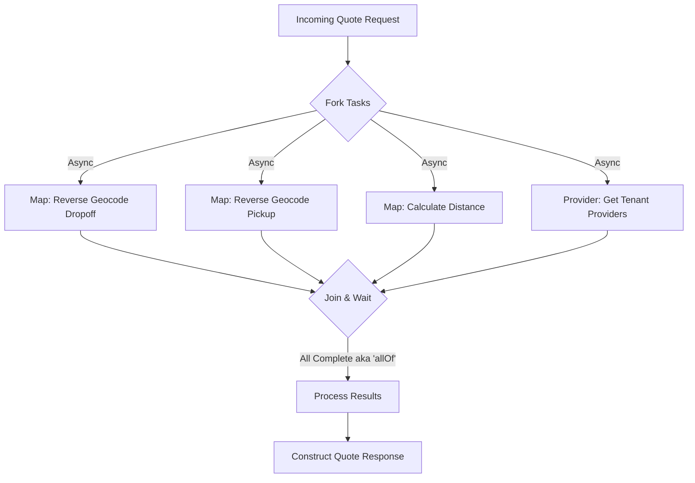

# Asynchronous Order Processing in SwiftTrack

## Overview

This document details the implementation of asynchronous processing for the **Order Quote Generation** (`getQuote`) workflow in the `OrderService`. The goal is to optimize performance by executing independent external service calls in parallel rather than sequentially.

## The Problem

The `getQuote` operation requires fetching data from multiple external sources:
1.  **Map Service (Dropoff Location)**: Reverse geocoding for the dropoff coordinates.
2.  **Map Service (Pickup Location)**: Reverse geocoding for the pickup coordinates.
3.  **Map Service (Distance)**: Calculating distance and traffic metrics between pickup and dropoff.
4.  **Provider Service**: Fetching the list of eligible providers for the tenant.

Originally, these calls were made sequentially. If each call took ~200ms, the total latency would be at least 800ms + processing time. If any service was slow, the total response time would degrade significantly.

## The Solution: Parallel Execution with `CompletableFuture`

We utilized Java's `CompletableFuture` API to trigger these I/O-bound tasks concurrently. This approach reduces the total response time to roughly the duration of the *slowest* single call, rather than the sum of all calls.

### Architecture Flow



## Implementation Details

The implementation uses `CompletableFuture.supplyAsync()` to offload tasks to the common ForkJoinPool (or a custom executor if configured). We then use `CompletableFuture.allOf()` to wait for completion.

### Key Constraints

*   **Timeout**: A strict **5-second timeout** is enforced. If the combined operation takes longer than 5 seconds, a `TimeoutException` is thrown, aborting the request. This prevents the Order Service from hanging indefinitely due to downstream service failures.
*   **Fail-Fast**: If any individual task fails with an exception, the main flow catches it and returns a standard error response.

### Code Pattern

```java
try {
    // 1. Initiate Async Calls
    CompletableFuture<ApiResponse<NormalizedLocation>> dropoffFuture = CompletableFuture
        .supplyAsync(() -> mapInterface.reverseGeocode(quoteInput.dropoffLat(), quoteInput.dropoffLng()));

    CompletableFuture<ApiResponse<NormalizedLocation>> pickupFuture = CompletableFuture
        .supplyAsync(() -> mapInterface.reverseGeocode(quoteInput.pickupLat(), quoteInput.pickupLng()));

    CompletableFuture<ApiResponse<DistanceResult>> distanceFuture = CompletableFuture
        .supplyAsync(() -> mapInterface.calculateDistance(...));

    CompletableFuture<List<GetProviders>> providersFuture = CompletableFuture
        .supplyAsync(() -> providerInterface.getTenantProviders(token));

    // 2. Wait for completion (Max 5 Seconds)
    CompletableFuture.allOf(dropoffFuture, pickupFuture, distanceFuture, providersFuture)
        .get(5, TimeUnit.SECONDS);

    // 3. Extract Results
    ApiResponse<NormalizedLocation> dropoffLocation = dropoffFuture.get();
    ApiResponse<NormalizedLocation> pickupLocation = pickupFuture.get();
    // ... process results ...

} catch (TimeoutException e) {
    throw new RuntimeException("Timeout while fetching data from external services", e);
} catch (Exception e) {
    throw new RuntimeException("Error occurred while processing quote", e);
}
```

## Benefits

1.  **Lower Latency**: significant reduction in user-perceived waiting time.
2.  **Resource Efficiency**: Threads are not blocked waiting for sequential I/O (though `get()` is blocking, the total blocking time is minimized).
3.  **Resilience**: The timeout ensures system stability under load.

## Future Improvements

*   **Custom Thread Pool**: Define a dedicated `ExecutorService` for these calls to avoid starving the common ForkJoinPool if load increases.
*   **Partial Success**: Implement logic to proceed even if non-critical calls (e.g., traffic stats) fail, using default fallback values.
