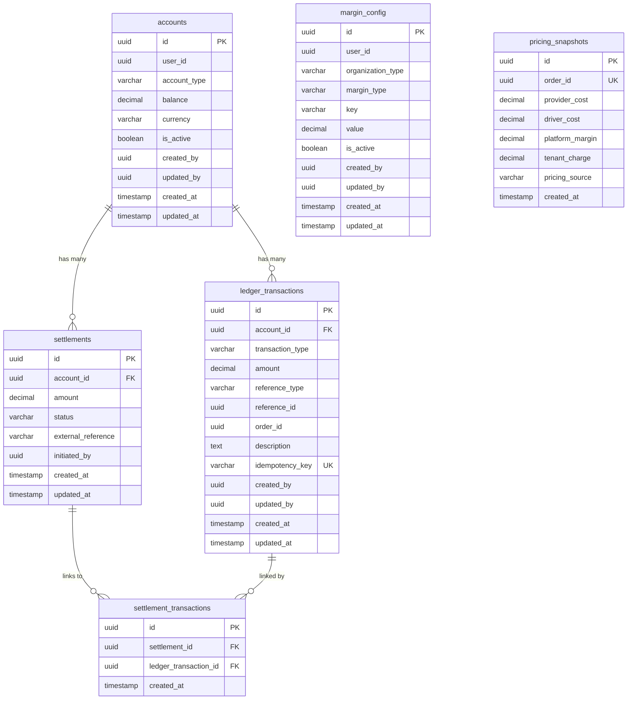

# Database Schema

All tables reside in the **`billing`** PostgreSQL schema. Primary keys are UUIDs generated via `gen_random_uuid()`. Monetary values use `NUMERIC(14,2)` for precision.

## Entity Relationship Diagram

---

## Table Definitions

### 1. `billing.accounts`

Represents a ledger account for a tenant, provider, driver, or the platform itself.

| Column | Type | Nullable | Default | Description |
|--------|------|----------|---------|-------------|
| `id` | `UUID` | ❌ | `gen_random_uuid()` | Primary key |
| `user_id` | `UUID` | ❌ | — | The entity this account belongs to (tenant ID, provider ID, driver ID, or platform ID) |
| `account_type` | `VARCHAR(20)` | ❌ | — | Enum: `TENANT`, `PROVIDER`, `DRIVER`, `PLATFORM` |
| `balance` | `DECIMAL(14,2)` | ❌ | `0.00` | Cached current balance (recalculated from ledger) |
| `currency` | `VARCHAR(3)` | ❌ | `INR` | ISO 4217 currency code |
| `is_active` | `BOOLEAN` | ❌ | `true` | Whether the account is active |
| `created_by` | `UUID` | ✅ | — | User who created this account |
| `updated_by` | `UUID` | ✅ | — | User who last updated this account |
| `created_at` | `TIMESTAMP` | ❌ | `CURRENT_TIMESTAMP` | Creation timestamp |
| `updated_at` | `TIMESTAMP` | ✅ | `CURRENT_TIMESTAMP` | Last update timestamp |

**Constraints:**
- `uq_accounts_user_type` — UNIQUE on `(user_id, account_type)` — one account per entity per type

**Indexes:**
- `idx_accounts_user_id` on `user_id`
- `idx_accounts_type` on `account_type`

---

### 2. `billing.ledger_transactions`

The **core financial table**. Every money movement creates an entry here. This table is **append-only** — entries are never modified or deleted.

| Column | Type | Nullable | Default | Description |
|--------|------|----------|---------|-------------|
| `id` | `UUID` | ❌ | `gen_random_uuid()` | Primary key |
| `account_id` | `UUID` | ❌ | — | FK → `accounts.id` |
| `transaction_type` | `VARCHAR(10)` | ❌ | — | Enum: `CREDIT`, `DEBIT` |
| `amount` | `DECIMAL(14,2)` | ❌ | — | Monetary amount (always positive) |
| `reference_type` | `VARCHAR(20)` | ❌ | — | Enum: `ORDER`, `SETTLEMENT`, `ADJUSTMENT` |
| `reference_id` | `UUID` | ❌ | — | ID of the source entity (order ID, settlement ID, etc.) |
| `order_id` | `UUID` | ✅ | — | Order this transaction relates to (nullable for non-order txns) |
| `description` | `TEXT` | ✅ | — | Human-readable description |
| `idempotency_key` | `VARCHAR(255)` | ✅ | — | Unique key to prevent duplicate entries |
| `created_by` | `UUID` | ✅ | — | User who created this entry |
| `updated_by` | `UUID` | ✅ | — | User who last updated this entry |
| `created_at` | `TIMESTAMP` | ❌ | `CURRENT_TIMESTAMP` | Creation timestamp |
| `updated_at` | `TIMESTAMP` | ✅ | `CURRENT_TIMESTAMP` | Last update timestamp |

**Constraints:**
- `fk_lt_account` — FK to `accounts.id`
- `uq_lt_idempotency_key` — UNIQUE on `idempotency_key`

**Indexes:**
- `idx_lt_account_id` on `account_id` — for account balance queries
- `idx_lt_order_id` on `order_id` — for order-level transaction tracing
- `idx_lt_reference` on `(reference_type, reference_id)` — for reference lookups
- `idx_lt_created_at` on `created_at` — for time-range queries

---

### 3. `billing.margin_config`

Stores margin configuration rules for tenants and the SwiftTrack platform.

| Column | Type | Nullable | Default | Description |
|--------|------|----------|---------|-------------|
| `id` | `UUID` | ❌ | `gen_random_uuid()` | Primary key |
| `user_id` | `UUID` | ❌ | — | Entity this config applies to |
| `organization_type` | `VARCHAR(20)` | ❌ | — | Enum: `SWIFTTRACK`, `TENANT` |
| `margin_type` | `VARCHAR(20)` | ❌ | — | Enum: `FLAT`, `PERCENTAGE` |
| `key` | `VARCHAR(100)` | ❌ | — | Config key (e.g., `base_margin`, `per_km_rate`) |
| `value` | `DECIMAL(14,4)` | ❌ | — | Config value (4 decimal precision for percentages) |
| `is_active` | `BOOLEAN` | ❌ | `true` | Whether this config is active |
| `created_by` | `UUID` | ✅ | — | Created by user |
| `updated_by` | `UUID` | ✅ | — | Last updated by user |
| `created_at` | `TIMESTAMP` | ❌ | `CURRENT_TIMESTAMP` | Creation timestamp |
| `updated_at` | `TIMESTAMP` | ✅ | `CURRENT_TIMESTAMP` | Last update timestamp |

**Indexes:**
- `idx_mc_user_active` on `(user_id, is_active)` — for active config lookups

---

### 4. `billing.pricing_snapshots`

Immutable snapshot of the final pricing calculation for each order. Created once and never modified.

| Column | Type | Nullable | Default | Description |
|--------|------|----------|---------|-------------|
| `id` | `UUID` | ❌ | `gen_random_uuid()` | Primary key |
| `order_id` | `UUID` | ❌ | — | The order this pricing belongs to (UNIQUE) |
| `provider_cost` | `DECIMAL(14,2)` | ✅ | — | Cost from external provider (null if not applicable) |
| `driver_cost` | `DECIMAL(14,2)` | ✅ | — | Cost for driver (null if external provider) |
| `platform_margin` | `DECIMAL(14,2)` | ❌ | — | SwiftTrack's margin/commission |
| `tenant_charge` | `DECIMAL(14,2)` | ❌ | — | Total amount charged to tenant |
| `pricing_source` | `VARCHAR(20)` | ❌ | — | Enum: `PROVIDER`, `TENANT_DRIVER`, `GIG_DRIVER` |
| `created_at` | `TIMESTAMP` | ❌ | `CURRENT_TIMESTAMP` | Creation timestamp |

**Constraints:**
- `order_id` is UNIQUE — one pricing snapshot per order

**Indexes:**
- `idx_ps_order_id` UNIQUE on `order_id`

---

### 5. `billing.settlements`

Tracks payout settlements to providers and drivers.

| Column | Type | Nullable | Default | Description |
|--------|------|----------|---------|-------------|
| `id` | `UUID` | ❌ | `gen_random_uuid()` | Primary key |
| `account_id` | `UUID` | ❌ | — | FK → `accounts.id` |
| `amount` | `DECIMAL(14,2)` | ❌ | — | Settlement payout amount |
| `status` | `VARCHAR(20)` | ❌ | `PENDING` | Enum: `PENDING`, `PROCESSING`, `SETTLED`, `FAILED` |
| `external_reference` | `VARCHAR(255)` | ✅ | — | Payment gateway reference/transaction ID |
| `initiated_by` | `UUID` | ✅ | — | User who initiated this settlement |
| `created_at` | `TIMESTAMP` | ❌ | `CURRENT_TIMESTAMP` | Creation timestamp |
| `updated_at` | `TIMESTAMP` | ✅ | `CURRENT_TIMESTAMP` | Last update timestamp |

**Constraints:**
- `fk_settlements_account` — FK to `accounts.id`

**Indexes:**
- `idx_settlements_account` on `account_id`
- `idx_settlements_status` on `status`

---

### 6. `billing.settlement_transactions`

Join table linking settlements to specific ledger transactions for complete traceability.

| Column | Type | Nullable | Default | Description |
|--------|------|----------|---------|-------------|
| `id` | `UUID` | ❌ | `gen_random_uuid()` | Primary key |
| `settlement_id` | `UUID` | ❌ | — | FK → `settlements.id` |
| `ledger_transaction_id` | `UUID` | ❌ | — | FK → `ledger_transactions.id` |
| `created_at` | `TIMESTAMP` | ❌ | `CURRENT_TIMESTAMP` | Creation timestamp |

**Constraints:**
- `fk_st_settlement` — FK to `settlements.id`
- `fk_st_ledger_transaction` — FK to `ledger_transactions.id`

**Indexes:**
- `idx_st_settlement` on `settlement_id`
- `idx_st_ledger` on `ledger_transaction_id`

---

## Enum Reference

| Enum | Values | Used In |
|------|--------|---------|
| `AccountType` | `TENANT`, `PROVIDER`, `DRIVER`, `PLATFORM` | `accounts.account_type` |
| `TransactionType` | `CREDIT`, `DEBIT` | `ledger_transactions.transaction_type` |
| `ReferenceType` | `ORDER`, `SETTLEMENT`, `ADJUSTMENT` | `ledger_transactions.reference_type` |
| `OrganizationType` | `SWIFTTRACK`, `TENANT` | `margin_config.organization_type` |
| `MarginType` | `FLAT`, `PERCENTAGE` | `margin_config.margin_type` |
| `PricingSource` | `PROVIDER`, `TENANT_DRIVER`, `GIG_DRIVER` | `pricing_snapshots.pricing_source` |
| `SettlementStatus` | `PENDING`, `PROCESSING`, `SETTLED`, `FAILED` | `settlements.status` |
